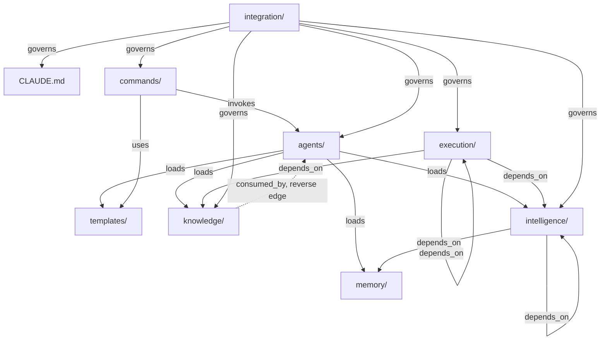

# Dependency Map

The human-readable rendering of `registry.yaml` — the same data, organized for a reader trying to understand the *shape* of the system rather than parse YAML. Every edge here is sourced from a `registry.yaml` field (`loads`, `invokes`, `consumed_by`, `depends_on`), not re-derived independently, so this file and the registry cannot silently drift apart in what they claim — if they ever disagree, `registry.yaml` governs (per its own header) and this file is out of date.

## Layer-Level Graph

This is the aggregate view — each node is a whole layer, each edge means "at least one file in the source layer declares a dependency on at least one file in the target layer" per `registry.yaml`.



Before `registry.yaml` existed, only two edges in this diagram were real (`COMMANDS -->|invokes| AGENTS` and `AGENTS -->|loads| MEMORY`/`TEMPLATES`) — everything touching `KNOWLEDGE`, `INTEL`, and `EXEC` existed only as unreferenced prose (`docs/framework-audit.md` §1.2). Every edge above is now backed by a `registry.yaml` entry.

## Per-Agent Load Chain

What actually gets pulled in when an agent runs, per `registry.yaml`'s `agents[].loads` field — this is the literal fix for `docs/framework-audit.md` §1.2, made visible:

| Agent | Memory | Knowledge | Intelligence | Templates |
|---|---|---|---|---|
| `agentic-ai-architect` | positioning-decisions, compliance-glossary | agentic-ai, ai-governance, eu-ai-act | capability-matrix, coordination-protocol, quality-gates, reasoning-patterns | agent-spec-template |
| `ai-governance-auditor` | compliance-glossary, non-fabrication-policy | ai-governance, eu-ai-act, agentic-ai | capability-matrix, coordination-protocol, quality-gates, reasoning-patterns, conflict-resolution, evaluation-engine | ai-governance-brief-template |
| `people-analytics-analyst` | service-lines, non-fabrication-policy | people-analytics, hr-strategy, ai-governance | capability-matrix, coordination-protocol, quality-gates, reasoning-patterns | — |
| `compensation-benefits-specialist` | compliance-glossary, non-fabrication-policy | compensation-total-rewards, eu-ai-act | capability-matrix, coordination-protocol, quality-gates, reasoning-patterns | — |
| `total-rewards-strategist` | service-lines, non-fabrication-policy | compensation-total-rewards, hr-strategy, people-analytics | capability-matrix, coordination-protocol, quality-gates, reasoning-patterns | — |
| `workforce-intelligence-strategist` | non-fabrication-policy | workforce-intelligence, people-analytics, hr-strategy | capability-matrix, coordination-protocol, quality-gates, reasoning-patterns | — |
| `competitive-positioning-analyst` | positioning-decisions, competitive-landscape, non-fabrication-policy | marketing, enterprise-sales, hr-strategy | capability-matrix, coordination-protocol, quality-gates, reasoning-patterns, evaluation-engine | competitive-battlecard-template |
| `client-content-writer` | brand-voice, positioning-decisions, non-fabrication-policy | consulting-methodologies, marketing | capability-matrix, coordination-protocol, quality-gates, reasoning-patterns, workflow-library | case-study, client-proposal, newsletter-issue, faq-entry templates |

## Command → Agent Invocation Chain

Sourced from `registry.yaml`'s `commands[].invokes` field:

```
agent-design        → agentic-ai-architect (primary) + ai-governance-auditor (mandatory)
ai-risk-classify     → ai-governance-auditor (primary) + agentic-ai-architect (optional)
case-study           → client-content-writer (primary) + owning specialist (dynamic) + competitive-positioning-analyst (mandatory)
comp-benchmark       → compensation-benefits-specialist (primary) → total-rewards-strategist (downstream consumer)
faq-entry            → client-content-writer (primary) + ai-governance-auditor (conditional)
newsletter-issue     → client-content-writer (primary) + competitive-positioning-analyst (mandatory)
pay-equity-audit     → compensation-benefits-specialist (primary) + ai-governance-auditor (conditional)
positioning-check    → competitive-positioning-analyst (primary) → client-content-writer (handoff)
proposal             → client-content-writer (primary) + service-line specialists (dynamic) + ai-governance-auditor (conditional) + competitive-positioning-analyst (mandatory)
workforce-forecast   → workforce-intelligence-strategist (primary) ← people-analytics-analyst (input)
```

## Knowledge → Agent Consumption Chain

Sourced from `registry.yaml`'s `knowledge[].consumed_by` field — this satisfies requirement 3 directly and is the reverse view of the Per-Agent Load Chain table above:

| Knowledge file | Consumed by |
|---|---|
| `agentic-ai.md` | agentic-ai-architect, ai-governance-auditor |
| `ai-governance.md` | ai-governance-auditor, agentic-ai-architect, people-analytics-analyst |
| `eu-ai-act.md` | ai-governance-auditor, agentic-ai-architect, compensation-benefits-specialist |
| `hr-strategy.md` | people-analytics-analyst, total-rewards-strategist, workforce-intelligence-strategist, competitive-positioning-analyst *(no owning agent — Coverage Gap)* |
| `people-analytics.md` | people-analytics-analyst, workforce-intelligence-strategist, total-rewards-strategist |
| `compensation-total-rewards.md` | compensation-benefits-specialist, total-rewards-strategist |
| `workforce-intelligence.md` | workforce-intelligence-strategist, people-analytics-analyst |
| `enterprise-sales.md` | competitive-positioning-analyst, client-content-writer *(no owning agent — Coverage Gap)* |
| `marketing.md` | competitive-positioning-analyst, client-content-writer |
| `consulting-methodologies.md` | client-content-writer + execution/project-manager, planning-engine, task-engine, documentation-engine |

Every knowledge file now has at least one declared consumer. The two Coverage Gap domains (`hr-strategy`, `enterprise-sales`) are consumed by multiple agents as *secondary* input but still have no *primary* owner — this is unchanged from `docs/framework-audit.md` and is a deliberate, documented gap, not a new one introduced here.

## Execution Layer Dependency Chain

Sourced from `registry.yaml`'s `execution[].depends_on` field — this satisfies requirement 4 directly:

```
project-manager        ← (no execution dependency — Discovery is first)      ← intelligence: decision-engine, conflict-resolution
planning-engine        ← project-manager                                     ← intelligence: capability-matrix, knowledge-graph  ← knowledge: consulting-methodologies
task-engine             ← planning-engine                                    ← intelligence: capability-matrix, knowledge-graph
implementation-engine   ← task-engine                                        ← intelligence: coordination-protocol
review-engine           ← implementation-engine                              ← intelligence: evaluation-engine
testing-engine          ← review-engine                                     ← intelligence: quality-gates, evaluation-engine
documentation-engine    ← all execution files (cross-cutting)                ← intelligence: learning-loop
release-engine          ← testing-engine, documentation-engine
continuous-improvement  ← release-engine                                     ← intelligence: learning-loop, decision-engine
workflow-orchestrator   ← all 9 other execution files                        ← intelligence: coordination-protocol, quality-gates, decision-engine
```

This is a clean linear chain with two cross-cutting files (`task-engine`, `documentation-engine`) that touch every phase, and one capstone (`workflow-orchestrator`) that depends on everything else in the layer — no cycles.

## Previously Orphaned Nodes — Now Connected

Per `registry.yaml`'s `orphans_resolved` section:

- **`competitive-battlecard-template.md`** — was a leaf node with zero inbound edges. Now: `positioning-check` (command) → `competitive-battlecard-template.md`, and `competitive-positioning-analyst` (agent) → `competitive-battlecard-template.md` (via its `loads.templates` field).
- **`execution/` (10 files)** — was an entirely disconnected subgraph reachable only by direct manual read. Now: `routing.md`'s project-scale-request rule provides the missing inbound edge from the request-handling layer into `project-manager.md` and `workflow-orchestrator.md`, and `bootstrap.md` guarantees the rest of the execution chain loads correctly once entered.

## Remaining Structural Notes

- `intelligence/reasoning-patterns.md` depends on both `memory/non-fabrication-policy.md` and two `knowledge/` files (`consulting-methodologies`, `agentic-ai`) — this is the one intelligence file with a direct knowledge-layer dependency rather than only agent/execution consumers; worth remembering if `reasoning-patterns.md` is ever revised, since a knowledge-file change could now ripple into it.
- No true dependency cycles were found in `registry.yaml`'s declarations — every `depends_on`/`loads` chain terminates at `memory/`, `knowledge/`, or a constitution-level file with no further dependency, which is the correct shape for this system (per `.claude/execution/workflow-orchestrator.md`'s own layer stack: execution → intelligence → agents → knowledge/memory, strictly downward).
