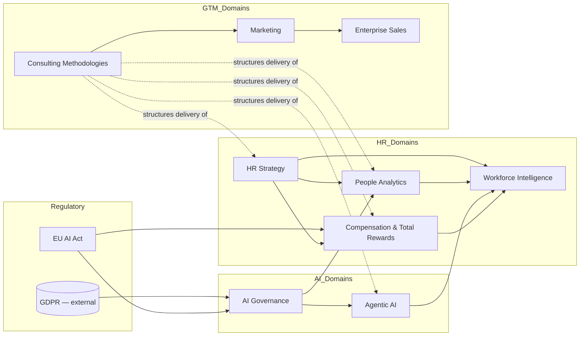

# Knowledge Graph

This file maps every domain in the system — knowledge domains, agents, memory, and service lines — as nodes with explicit relationships. It is the map the orchestrator (see `coordination-protocol.md`) and the decision engine (`decision-engine.md`) consult to understand what connects to what, so agent selection and multi-domain reasoning are based on real structural relationships rather than guesswork.

## Node Types

| Type | Count | Source folder |
|---|---|---|
| Knowledge Domain | 10 | `.claude/knowledge/` |
| Agent | 8 | `.claude/agents/` |
| Memory File | 7 | `.claude/memory/` |
| Service Line | 6 | defined in `.claude/memory/service-lines.md` |
| Workflow | 10+ | `.claude/intelligence/workflow-library.md` |

## Relationship Types

- **`depends on`** — domain A's claims are only valid if domain B's constraints are satisfied first (e.g., any Agentic AI claim depends on AI Governance sign-off).
- **`informs`** — domain A's frameworks shape how domain B's work should be done, without a hard blocking dependency.
- **`gates`** — domain A can block domain B's output from shipping (a subset of `depends on` used specifically for quality-gate relationships — see `quality-gates.md`).
- **`feeds`** — domain A's output is a direct input to domain B's work.
- **`escalates to`** — unresolved questions in domain A route to domain B's specialist.

## Domain Relationship Map

| Domain | Depends on | Informs / Feeds | Gates | Primary Agent(s) |
|---|---|---|---|---|
| Agentic AI | AI Governance, EU AI Act | HR Strategy (execution), Workforce Intelligence (Bot lever) | — | `agentic-ai-architect` |
| AI Governance | EU AI Act, GDPR (external) | Agentic AI, People Analytics (model bias), Compensation & Total Rewards (automated pay tooling) | Agentic AI, People Analytics predictive models | `ai-governance-auditor` |
| EU AI Act | (external: EU regulation) | AI Governance, Agentic AI, Compensation & Total Rewards (Pay Transparency Directive) | AI Governance | `ai-governance-auditor` |
| HR Strategy | — | People Analytics, Workforce Intelligence, Compensation & Total Rewards, Consulting Methodologies | — | (cross-cutting; no single owning agent — see Coverage Gaps) |
| People Analytics | AI Governance (when predictive/scoring) | HR Strategy, Workforce Intelligence, Agentic AI (diagnostic agents) | — | `people-analytics-analyst` |
| Compensation & Total Rewards | EU AI Act (Pay Transparency Directive) | HR Strategy, Total Rewards synthesis | — | `compensation-benefits-specialist`, `total-rewards-strategist` |
| Workforce Intelligence | People Analytics (data foundation) | HR Strategy, Agentic AI (Bot lever), Compensation & Total Rewards (comp-driven attrition) | — | `workforce-intelligence-strategist` |
| Enterprise Sales | AI Governance (procurement/security gate), Marketing (positioning input) | — | — | (no dedicated agent — see Coverage Gaps) |
| Marketing | — | Enterprise Sales, Consulting Methodologies (thought leadership) | — | `competitive-positioning-analyst`, `client-content-writer` |
| Consulting Methodologies | — | all domains (structures how any domain's findings are delivered) | — | `client-content-writer` |

## Agent-to-Knowledge Mapping

Every agent's system prompt names the memory files it must read; this table adds the **knowledge domain(s)** each agent's judgment should be grounded in — the two together (`memory/` for firm facts, `knowledge/` for field expertise) are what `.claude/knowledge/README.md` calls "who Datalent is" + "what a real expert knows."

| Agent | Primary Knowledge Domain(s) | Secondary Domain(s) |
|---|---|---|
| `agentic-ai-architect` | Agentic AI | AI Governance, EU AI Act |
| `ai-governance-auditor` | AI Governance, EU AI Act | Agentic AI, People Analytics |
| `people-analytics-analyst` | People Analytics | HR Strategy, AI Governance (bias) |
| `compensation-benefits-specialist` | Compensation & Total Rewards | EU AI Act (Pay Transparency Directive) |
| `total-rewards-strategist` | Compensation & Total Rewards | HR Strategy, People Analytics |
| `workforce-intelligence-strategist` | Workforce Intelligence | People Analytics, HR Strategy |
| `competitive-positioning-analyst` | Marketing | Enterprise Sales, HR Strategy |
| `client-content-writer` | Consulting Methodologies | Marketing, all domains (as a synthesis layer) |

## Coverage Gaps (explicit, not hidden)

Two knowledge domains exist in `.claude/knowledge/` with **no dedicated owning agent**:

- **HR Strategy** — cross-cutting by design; every domain specialist should read it, but no agent is *responsible* for pure org-design/operating-model work. Requests centered purely on HR operating-model design should be routed to `people-analytics-analyst` (closest fit for diagnostic HR strategy work) with an explicit note that this is outside its primary scope, or escalated to a human per `decision-engine.md`.
- **Enterprise Sales** — no dedicated agent produces sales collateral directly; `client-content-writer` drafts proposals (a sales artifact) but the sales *methodology* (MEDDIC qualification, buying-committee mapping) has no agent applying it. Treat Enterprise Sales knowledge as informing how `client-content-writer` and `competitive-positioning-analyst` shape proposal/battlecard content, not as an independently invokable specialist.

This gap is deliberate to record here rather than paper over with a forced agent assignment — see `.claude/memory/non-fabrication-policy.md`'s spirit applied structurally: an honest gap beats a false capability claim.

## Graph Diagram

## How to Use This Map

- Before selecting agents for a multi-domain request (see `capability-matrix.md` and `coordination-protocol.md`), trace the request's domains through this graph — any `depends on` edge means the dependent domain's agent must sign off before the dependency's output ships (this becomes a quality gate; see `quality-gates.md`).
- If a request touches a domain in the Coverage Gaps list, flag that explicitly to the user rather than silently assigning it to the nearest agent as if it were a perfect fit.
- Update this file whenever a new agent, knowledge domain, or memory file is added — an out-of-date graph produces wrong orchestration decisions silently, which is worse than no graph at all.
